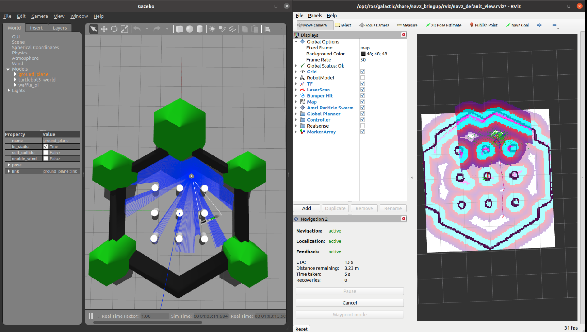

# Navigation 2 demo in ROS2 using TurtleBot3 (Humble)



This repository demonstrates the usage of Navigation 2 framework in ROS 2 using TurtleBot3 Gazebo simulation. The task at hand - making the robot patrol an area (with 4 configured points in the map, for simplicity).

It is inspired by the works of Davide Faconti's [BehaviorTree.CPP](https://www.behaviortree.dev/) and Sebastian Castro's [Navigation 2 demo](https://github.com/sea-bass/turtlebot3_behavior_demos). In fact, I learned quite a bit from Sebastian's repository. So you can also look at his work to learn, as this repo has a lot in common with it. I reverse engineered and stripped down navigation 2 demo further for first time developers. I hope this serves as a great base for you to start working with Navigation 2 in ROS 2.

The repository is in service of Navigation 2 Learning experience and fulfills the demonstration of the following -
* Navigation 2 framework
* Behavior Trees (C++)

Additionally, for first time ROS 2 developers, this repository also demonstrates the following -
* ROS 2 python package usage
* ROS 2 C++ package usage
* ROS 2 launch infrastructure

You need ROS 2 (current main branch uses humble, galactic is in another branch) and TurtleBot3 simulation woking on Gazebo. You're good to go if you can follow [this](https://medium.com/@thehummingbird/ros-2-mobile-robotics-series-part-1-8b9d1b74216) TurtleBot 3 ROS 2 tutorial successfully.

To reproduce the above result, follow the steps below -

1. Clone this repository in a new ros2 workspace in src directory (`turtlebot3_ws/src`) 
```
git clone git@github.com:thehummingbird/nav2_demo_turtlebot3.git .
```
2. Import TurtleBot3 packages with vcs 
```
vcs import . < turtlebot3.repos
```
3. Build all packages from workspace directory (`turtlebot3_ws`)
```
colcon build --symlink-install

Ignore sterr output (that's a warning)
```
4. Source the workspace
```
source ./install/setup.bash
```
5. Export TurtleBot3 model

```
export GAZEBO_MODEL_PATH=$GAZEBO_MODEL_PATH:~/turtlebot3_ws/src/turtlebot3/turtlebot3_simulations/turtlebot3_gazebo/models

export TURTLEBOT3_MODEL=waffle_pi
```

6. Launch turtlebot3 simulation infrastructure

```
ros2 launch tb3_sim turtlebot3_world.launch.py
```

7. Launch nav2 infrastructure (nav2 + amcl initial pose)

```
source ./install/setup.bash
ros2 launch tb3_sim nav2.launch.py
```

8. Launch autonomy behavior for demo

```
source ./install/setup.bash
ros2 launch tb3_autonomy autonomy.launch.py
```

This starts our demonstration where TurtleBot moves between 4 different locations in the world simulation (set in `tb3_sim/config/sim_house_locations.yaml`)


